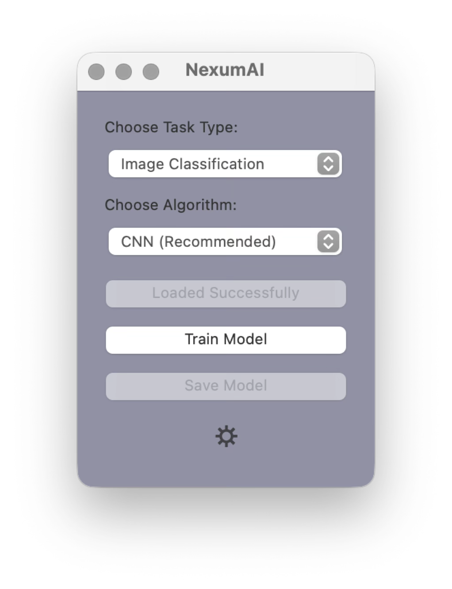
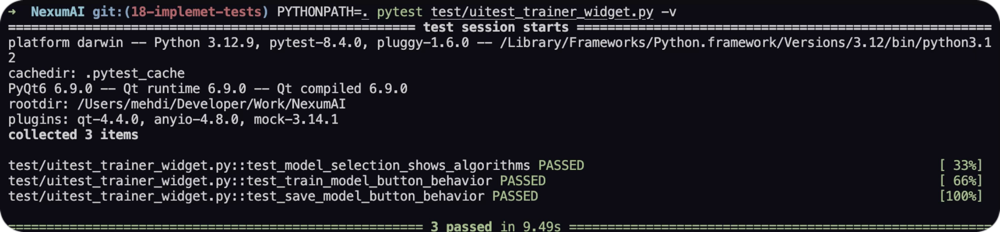

# NexumAI

NexumAI is a powerful machine learning application that provides a user-friendly interface for training various types of models, including image classification, image segmentation, and voice classification.

<p align="center">  </p>

## Requirements

- Python 3.x
- PyQt6
- PyTorch
- TensorFlow
- pandas
- torchvision

## Installation

1. Clone the repository:
```bash
git clone https://github.com/karami-mehdi/NexumAI.git
cd NexumAI
```

2. Install dependencies:
```bash
pip install -r requirements.txt
```

## Usage

Run the application from the root directory:

```bash
python app/main.py
```

This will launch the GUI interface where you can:
1. Select your dataset
2. Choose the model type (Image Classification, Image Segmentation, or Voice Classification)
3. Select the specific architecture
4. Train and evaluate your model

## Project Structure

```
NexumAI/
├── app/
│   └── main.py
├── core/
│   ├── model_generator.py
│   ├── model_saver.py
│   ├── model_selector.py
│   └── model_trainer.py
├── infrastructure/
│   └── data/
│       └── dataset_loader.py
├── presentation/
│   └── widgets/
│       ├── setting_window.py
│       └── trainer_widget.py
└── test/
    ├── test_model_generator.py
    ├── test_model_trainer.py
    └── uitest_trainer_widget.py
```

## Model Types and Architectures

> Note that some features are still in progress.

### Image Classification
- **CNN (Recommended)**
- **SVM**
  - Alternative for smaller datasets
  - Traditional machine learning approach
  - In progress

### Image Segmentation
- **U-Net (Recommended)**
  - Specialized architecture for semantic segmentation

- **CNN**
  - Basic segmentation capabilities
  - Suitable for simpler segmentation tasks

### Voice Classification
- In progress

## Testing

The project includes comprehensive unit tests and UI tests.

Model Generator Tests:
<p align="center">  </p>

Model Trainer Tests:
<p align="center">  </p>

UI Tests:
<p align="center">  </p>

## Accessibility

Light/Dark Mode
<p align="center">
    
    
</p>

Font Size
<p align="center">  </p>
<p align="center">
  
  
  
</p>

## Sequence Diagram

<p align="center">  </p>

## License

This project is licensed under the MIT License - see the [LICENSE](LICENSE) file for details.
